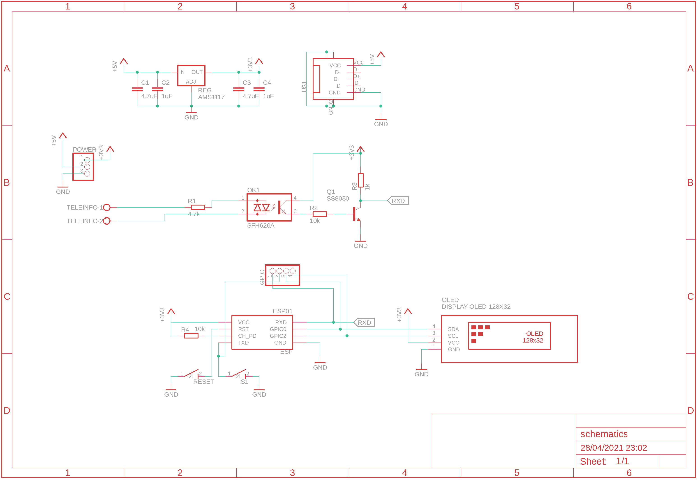
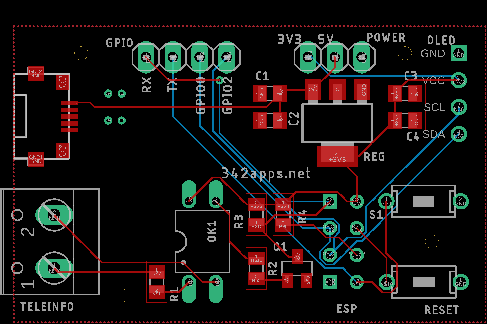

# teleinfokit-board

## Firmware TeleInfoKit

Ce repo comprend les fichiers source Eagle, schema et PCB pour le module de collecte de tele-information [Teleinfokit](https://342apps.net/module-teleinfokit/) associé à son [firmware dédié](https://github.com/342apps/teleinfokit).

Ce module permet de récupérer les données de consommation électrique grâce aux données de télé-information du bus TIC des compteurs électriques français et d'exploiter ces données dans une application de domotique telle que Home Assistant.

## Compatibilité avec ESPHome

Ce module est également compatible avec un firmware généré par [ESPHome](https://esphome.io/) pour une integration dans Home Assistant. Le fichier de configuration compatible avec ce module est disponible dans le dossier [esphome](./esphome/). Ce firmware offre cependant moins de fonctionnalités que le firmware natif.

Une version du firmware avec un capteur de température/pression de type BMP280 sur le même bus I2C que l'écran est disponible également dans le dossier [esphome/teleinfokit_bmp.yml](./esphome/). Le capteur est connecté via les pins déportés sur le bord du circuit (SDA : `GPIO0` et SCL : `GPIO2`) pour le bus I2C et l'alimentation par le 3V3 également accessible.

## Schéma

Fichier source [schematics Eagle](eagle/teleinfokit.sch)

## PCB

Fichier source [board Eagle](eagle/teleinfokit.brd)

### Gerber files

Toutes les ressources de production générées par Eagle sont dans le dossier [CAMOutputs](CAMOutputs).
