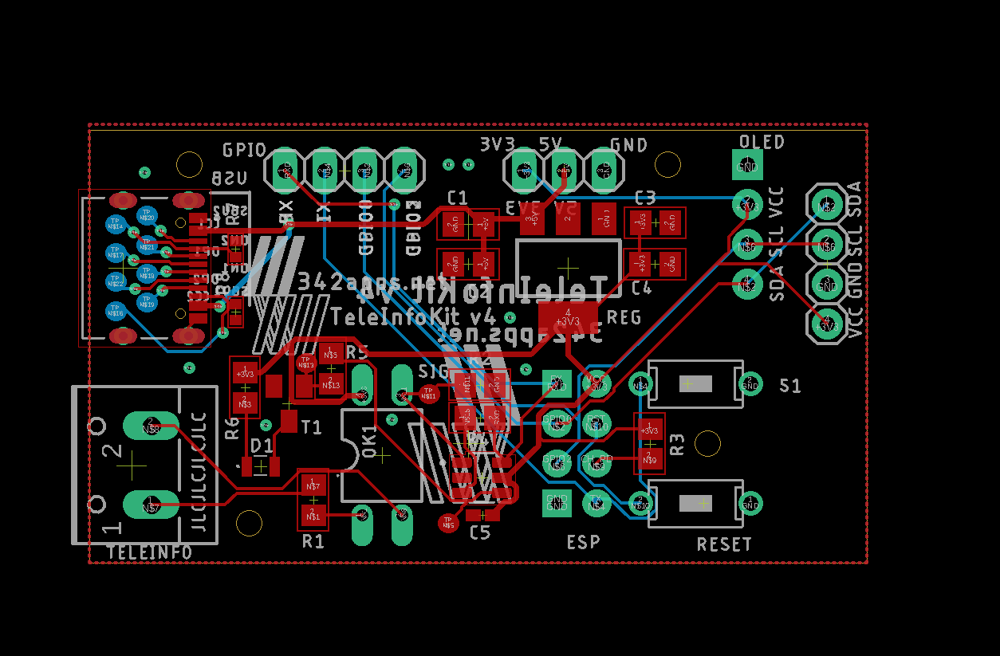

# teleinfokit-board

## Firmware TeleInfoKit

Ce repo comprend les fichiers source Eagle, schema et PCB pour le module de collecte de tele-information [Teleinfokit](https://342apps.net/module-teleinfokit/) associé à son [firmware dédié](https://github.com/342apps/teleinfokit).

Ce module permet de récupérer les données de consommation électrique grâce aux données de télé-information du bus TIC des compteurs électriques français et d'exploiter ces données dans une application de domotique telle que Home Assistant.

## Compatibilité avec ESPHome

Ce module est également compatible avec un firmware généré par [ESPHome](https://esphome.io/) pour une integration dans Home Assistant. 

Le fichier de configuration compatible avec ce module ainsi que toute la documentation est disponible dans le dossier [esphome](./esphome/). Ce firmware offre cependant moins de fonctionnalités que le firmware natif.

## PCB

Fichier source [schematics Eagle](eagle/v4/schematics.sch)

Les versions hardware 3 et 4 sont disponibles dans leurs [répertoires dédiés](/eagle/).

### Gerber files

Toutes les ressources de production générées par Eagle sont dans le dossier [CAMOutputs](CAMOutputs).
